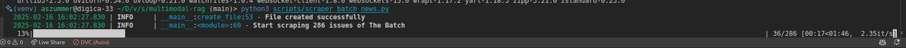
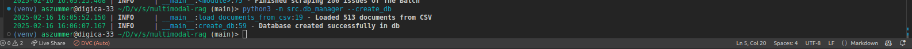
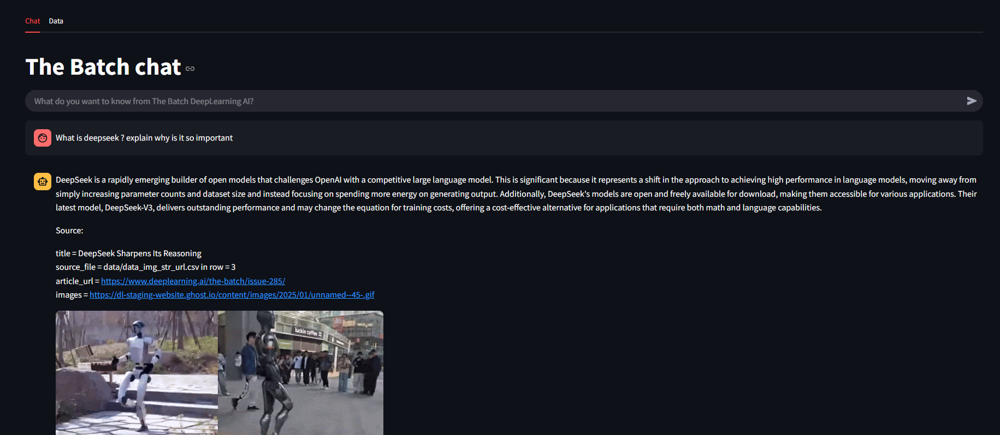
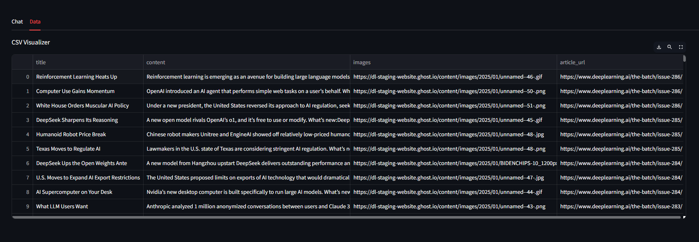
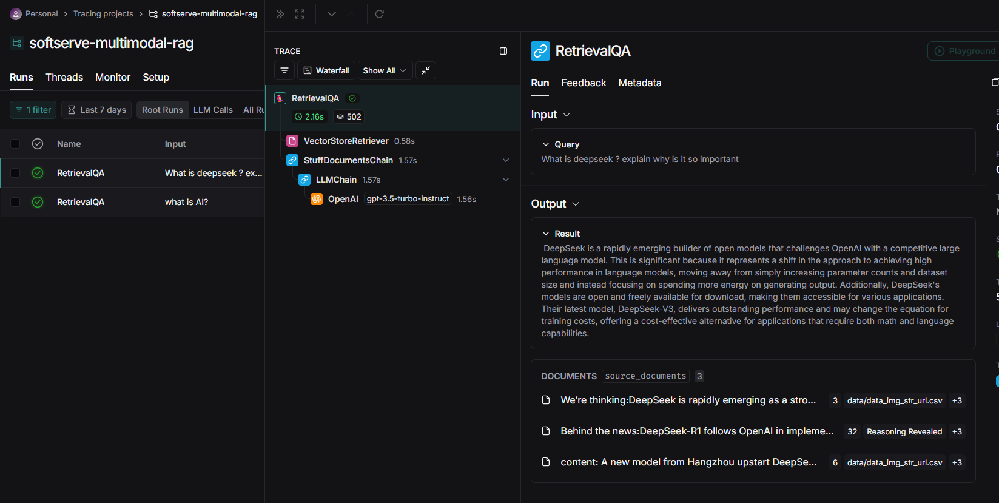
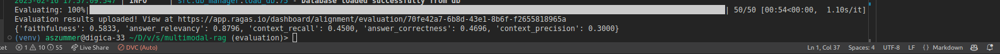
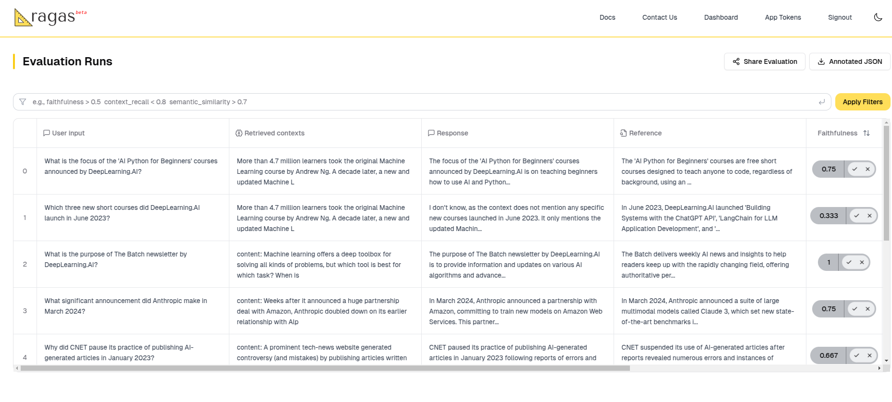

# multimodal-rag

```bash
python3 -m venv venv
source venv/bin/activate
pip install -r requirements.txt
```

## Run Everything from main multimodal-rag directory
Repository already contains scrapped data and have access to vector db if you cloned the whole repo. Therefore there is no requirement to run digesting pipeline but i keep instruction just in case.

### if you want to check digesting pipeline run 1-4
1. To scrape the Articles run

```python
python3 scripts/scraper_batch_news.py
```



2. To download all images from the scraped data

```python
python3 scripts/download_img.py
```

3.  in secrets folder create **secret.yaml** file.


secrets/secrets.yaml
```
LANGSMITH_TRACING: true
LANGSMITH_ENDPOINT: "https://api.smith.langchain.com"
LANGSMITH_API_KEY: "YOUR_API_KEY"
LANGSMITH_PROJECT: "softserve-multimodal-rag"
OPENAI_API_KEY: "YOUR_API_KEY
```

4. Create Vector Database
```
python3 -m src.db_manager --create_db
```



### If you just want to check the RAG run 5-7

5. in secrets folder create **secret.yaml** file.


secrets/secrets.yaml
```
LANGSMITH_TRACING: true
LANGSMITH_ENDPOINT: "https://api.smith.langchain.com"
LANGSMITH_API_KEY: "YOUR_API_KEY"
LANGSMITH_PROJECT: "softserve-multimodal-rag"
OPENAI_API_KEY: "YOUR_API_KEY
```

6. Run streamlit APP
```bash
streamlit run app.py
```

You can now view your Streamlit app in your browser.

Local URL: http://localhost:8501

7. Enter The App

You can write a question and get answer in the format:



or change the tab to "Data" and view the source data 



8. Go to LangSmith to check your Call trace



### If you want to run evaluation
Ensure you provided ragas app token in secrets file

```
python3 -m src.evaluator
```





